# domgwas 0.2 publication validation and comparison with ADDO

## Executive conclusion

The principal statistical blocker identified for domgwas 0.1.0 has been corrected. domgwas 0.2 transforms the phenotype, intercept, covariates, additive dosage, and dominance code with the same chromosome-specific covariance operator. Across 100 marker checks, coefficients and p-values matched direct complete-design GLS to machine precision (maximum score difference 7.77e-15). Numeric and categorical covariate tests showed the same equivalence.

On four real quantitative phenotypes and 35,723 variants, corrected domgwas retained Spearman concordance of 0.980-0.999 with ADDO and completed in 19.47 s versus 2789.1 s for ADDO (143.2-fold on this Windows workstation). High concordance is not evidence that either model is biologically correct: domgwas uses additive LOCO covariance, whereas ADDO estimates whole-genome additive and dominance variance components.

The package is now suitable for a methods/software preprint and manuscript drafting. A final biological or definitive statistical-method submission still requires independent replication, locked phenotype/QC choices, and either improvement or explicit limits for the low-rank large-n approximation. Shared cluster effects not represented by the GRM caused mild inflation, so cohort/family covariates remain essential.

## Corrected statistical model

For chromosome c, domgwas fits `V_c = sigma2[h2 K_add,-c + (1-h2)I]`, where `K_add,-c` excludes the tested chromosome. Profile REML includes the complete fixed-effect design. With `L_c = V_c^(-1/2)`, the fitted marker model is `L_c y = L_c C beta + a L_c A + d L_c D + error`, where `A` is dosage 0/1/2 and `D` is the heterozygote indicator 0/1/0. This is GLS, not the phenotype-only approximation used in v0.1.0.

ADDO's tested AddDom path uses `V = sigma_A2 K_A + sigma_D2 K_D + sigma_e2 I` estimated through GCTA and includes whole-genome additive and dominance GRMs. ADDO models dominance covariance explicitly but may incur proximal contamination because tested-chromosome markers contribute to the covariance. domgwas removes tested-chromosome additive markers but does not model a dominance GRM. The covariance benchmark below isolates these choices on identical phenotypes.

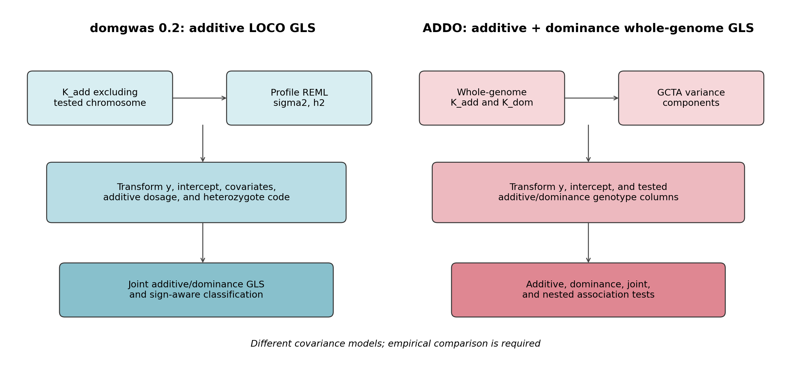

## Numerical correctness and covariates

Nine unit tests passed. Direct GLS comparison used 100 variants; maximum coefficient and score differences were 1.67e-15 and 7.77e-15. Covariate coefficient and score differences were 2.78e-16 and 6.22e-15. Per-trait missingness retained 400 samples for a complete trait and 363 for a trait with 37 missing observations; forced joint complete-case analysis reduced both traits to 363.

Sign-aware inheritance classification had 86.4% overall coarse-class accuracy across 1,000 replicates. `d/a` is now signed, allele-direction labels are reported, and effects with additive estimates within one standard error of zero are labelled unstable rather than assigned an arbitrarily extreme ratio.

| truth       |   replicates |   coarse_accuracy |   median_signed_d_over_a |
|:------------|-------------:|------------------:|-------------------------:|
| additive    |          200 |             0.91  |                    0.01  |
| complete_A0 |          200 |             0.94  |                   -1.019 |
| complete_A1 |          200 |             0.715 |                    0.981 |
| over_high   |          200 |             0.96  |                    1.781 |
| partial_A1  |          200 |             0.795 |                    0.509 |

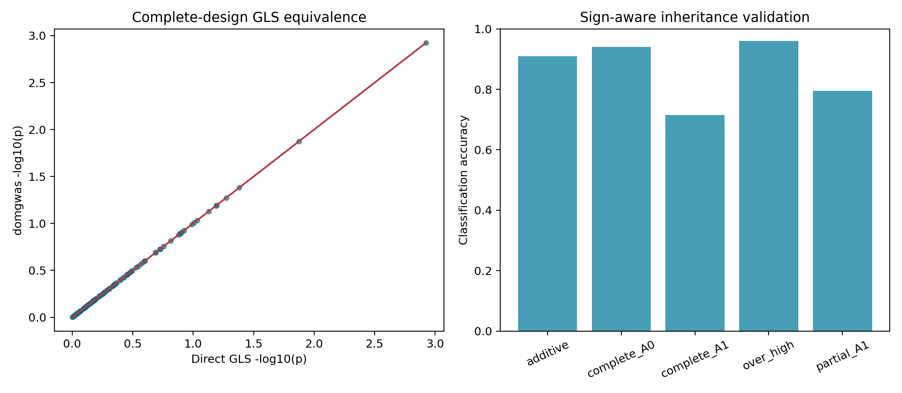

Profile REML heritability estimation was tested over 100 replicates at true h2 values 0, 0.2, 0.5, and 0.8 while fitting an explicit fixed covariate:

|   true_h2 |   replicates |   mean_estimate |   median_estimate |   convergence_rate |   bias |   rmse |
|----------:|-------------:|----------------:|------------------:|-------------------:|-------:|-------:|
|       0   |          100 |           0.023 |             0     |                  1 |  0.023 |  0.044 |
|       0.2 |          100 |           0.209 |             0.213 |                  1 |  0.009 |  0.085 |
|       0.5 |          100 |           0.498 |             0.5   |                  1 | -0.002 |  0.101 |
|       0.8 |          100 |           0.794 |             0.794 |                  1 | -0.006 |  0.076 |

All optimizations converged; maximum absolute mean bias was 0.023.

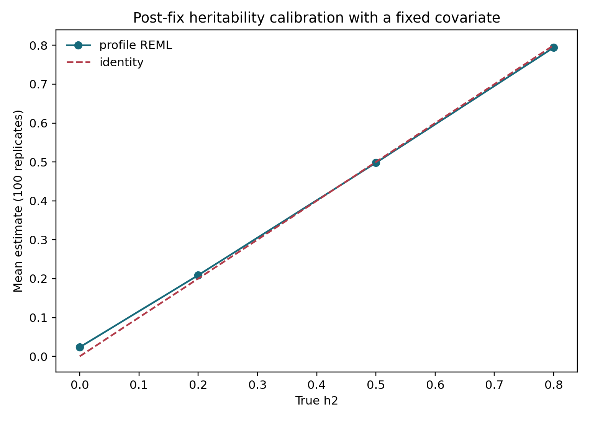

## Type I error under real LD

The post-fix study resampled 1,200 markers in four contiguous chromosome segments from the real rat panel and used 300 animals. Each scenario contains 1,000 phenotype replicates. FWER uses Bonferroni correction over each tested chromosome and Wilson 95% confidence intervals.

| scenario                         | test            |   replicates |   lambda_median |   nominal_0.05_rate |   bonferroni_fwer |   fwer_ci_low |   fwer_ci_high |
|:---------------------------------|:----------------|-------------:|----------------:|--------------------:|------------------:|--------------:|---------------:|
| independent_null                 | add_vs_add_dom  |         1000 |           1.026 |               0.052 |             0.008 |         0.004 |          0.016 |
| independent_null                 | additive_joint  |         1000 |           0.986 |               0.047 |             0.015 |         0.009 |          0.025 |
| independent_null                 | dominance_joint |         1000 |           1.022 |               0.052 |             0.008 |         0.004 |          0.016 |
| matched_polygenic_LD_null        | add_vs_add_dom  |         1000 |           0.976 |               0.048 |             0.008 |         0.004 |          0.016 |
| matched_polygenic_LD_null        | additive_joint  |         1000 |           1.007 |               0.05  |             0.006 |         0.003 |          0.013 |
| matched_polygenic_LD_null        | dominance_joint |         1000 |           0.976 |               0.048 |             0.008 |         0.004 |          0.016 |
| shared_cluster_misspecified_null | add_vs_add_dom  |         1000 |           1.097 |               0.063 |             0.019 |         0.012 |          0.029 |
| shared_cluster_misspecified_null | additive_joint  |         1000 |           1.104 |               0.06  |             0.013 |         0.008 |          0.022 |
| shared_cluster_misspecified_null | dominance_joint |         1000 |           1.097 |               0.063 |             0.019 |         0.012 |          0.029 |

Matched independent and polygenic scenarios had marker-level error near 0.05 and lambda near one. FWER was conservative because markers were in LD. The misspecified shared-cluster scenario produced lambda about 1.10 and marker-level error about 0.06, showing that a GRM does not substitute for relevant family, batch, or cohort effects.

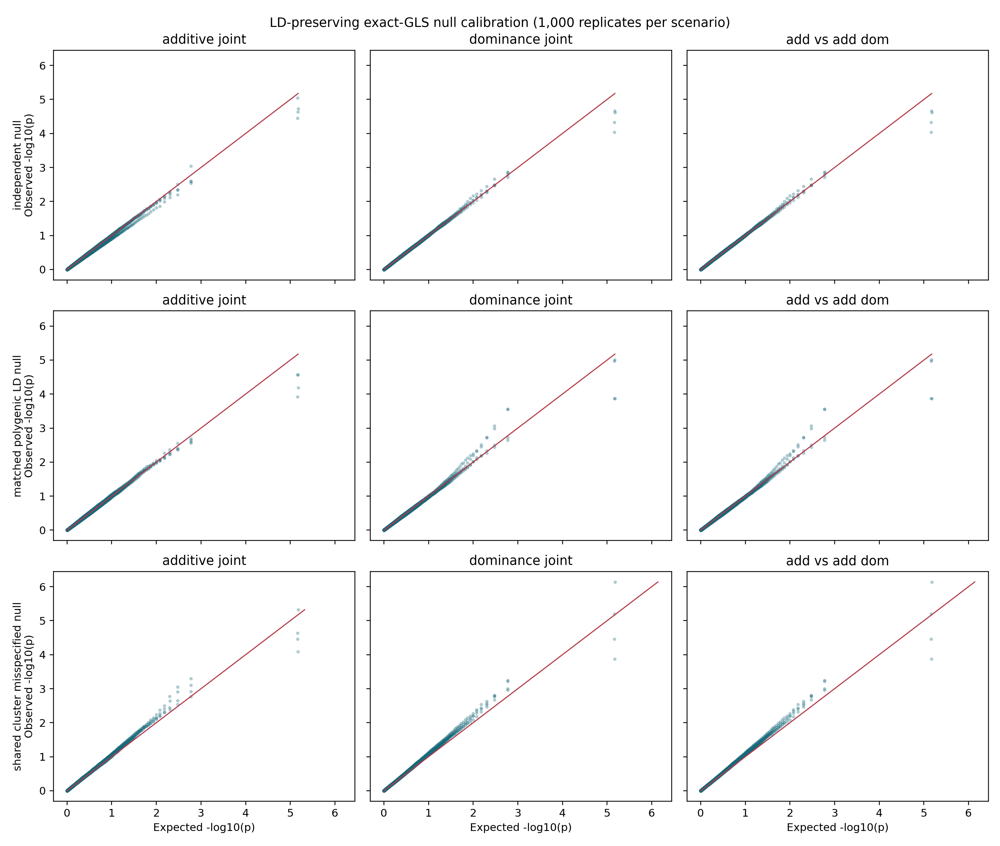

## Power and architecture sensitivity

The LD-panel power grid used 30 replicates per point, a 5% causal-locus variance, and a Bonferroni threshold over 300 tested markers. These estimates are intentionally reported with wide Wilson intervals; they describe this design rather than universal power.

| architecture      |   replicates |   power |   power_ci_low |   power_ci_high |   median_rank |   median_maf |
|:------------------|-------------:|--------:|---------------:|----------------:|--------------:|-------------:|
| additive          |           30 |   0.1   |          0.035 |           0.256 |             1 |        0.328 |
| partial_dominance |           30 |   0     |          0     |           0.114 |             1 |        0.295 |
| dominant          |           30 |   0.067 |          0.018 |           0.213 |             1 |        0.289 |
| recessive         |           30 |   0     |          0     |           0.114 |             1 |        0.266 |
| overdominant      |           30 |   0.567 |          0.392 |           0.726 |             2 |        0.296 |

Power was strongly architecture- and MAF-dependent. The full sensitivity table includes low MAF, 5% genotype missingness with mean imputation, h2 of 0.10 and 0.60, and shared clusters of size 2 and 8. Family simulations additionally varied true sibship size (2, 4, and 8) and chromosome count (2, 4, and 10) over 200 replicates per design.

|   family_size |   n_chromosomes | test            |   replicates |   lambda_median |   fwer |   fwer_ci_low |   fwer_ci_high |
|--------------:|----------------:|:----------------|-------------:|----------------:|-------:|--------------:|---------------:|
|             2 |               4 | additive_joint  |          200 |           1.028 |  0.07  |         0.042 |          0.114 |
|             2 |               4 | dominance_joint |          200 |           0.999 |  0.065 |         0.038 |          0.108 |
|             4 |               2 | additive_joint  |          200 |           1.009 |  0.025 |         0.011 |          0.057 |
|             4 |               2 | dominance_joint |          200 |           1.016 |  0.035 |         0.017 |          0.07  |
|             4 |               4 | additive_joint  |          200 |           0.991 |  0.03  |         0.014 |          0.064 |
|             4 |               4 | dominance_joint |          200 |           0.98  |  0.04  |         0.02  |          0.077 |
|             4 |              10 | additive_joint  |          200 |           1.04  |  0.05  |         0.027 |          0.09  |
|             4 |              10 | dominance_joint |          200 |           1.01  |  0.05  |         0.027 |          0.09  |
|             8 |               4 | additive_joint  |          200 |           0.989 |  0.085 |         0.054 |          0.132 |
|             8 |               4 | dominance_joint |          200 |           1.021 |  0.045 |         0.024 |          0.083 |

In 100 mixed-polygenic replicates with ten additive and ten dominance causal variants, at least one causal marker reached Bonferroni significance in 62% of additive and 68% of dominance components. The top 50 contained means of 2.91 additive and 3.82 dominance causal variants.

| component   |   replicates |   any_causal_power |   mean_causal_top50 |   mean_significant_causal |
|:------------|-------------:|-------------------:|--------------------:|--------------------------:|
| additive    |          100 |               0.62 |                2.91 |                      1.25 |
| dominance   |          100 |               0.68 |                3.82 |                      1.01 |

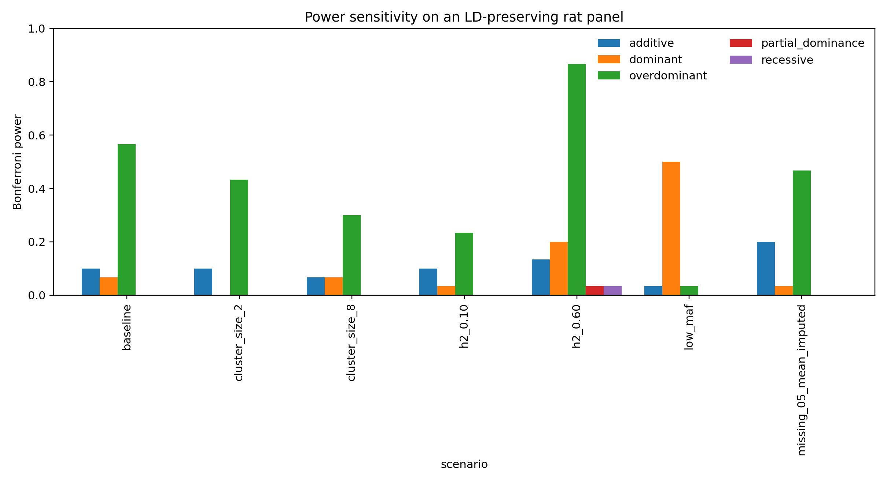

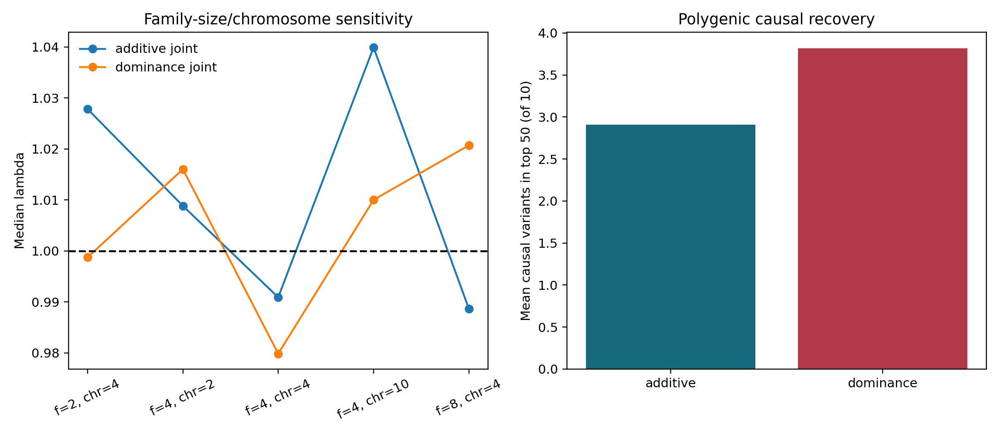

## Covariance-model benchmark

Phenotypes generated from additive-plus-dominance covariance were tested with three correction models. The ADDO-like entry reproduces its whole-genome covariance structure but is an in-Python model experiment, not an execution of ADDO's R/GCTA code.

| covariance_model                               |   replicates |   lambda_median |   fwer |   power |   median_causal_p |
|:-----------------------------------------------|-------------:|----------------:|-------:|--------:|------------------:|
| additive_only_LOCO                             |          200 |           1.041 |  0.02  |    0.71 |                 0 |
| exact_additive_plus_dominance_LOCO             |          200 |           0.973 |  0.015 |    0.79 |                 0 |
| whole_genome_additive_plus_dominance_ADDO_like |          200 |           0.719 |  0     |    0.51 |                 0 |

Exact additive-plus-dominance LOCO had the highest simulated dominance power (0.79). Additive-only LOCO retained 0.71 power with lambda 1.04. Whole-genome additive-plus-dominance correction was conservative (lambda 0.72, power 0.51), consistent with proximal signal absorption in this design. This does not establish universal superiority of LOCO.

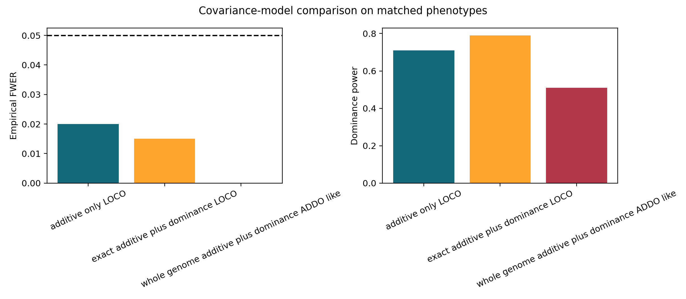

## Rare variants and genotype cells

|   min_genotype_count |   n_variants |   n_pass |   fraction_pass |   median_maf_pass |
|---------------------:|-------------:|---------:|----------------:|------------------:|
|                    0 |         1200 |     1200 |           1     |             0.266 |
|                    2 |         1200 |     1131 |           0.943 |             0.27  |
|                    5 |         1200 |      936 |           0.78  |             0.293 |
|                   10 |         1200 |      825 |           0.688 |             0.309 |
|                   20 |         1200 |      618 |           0.515 |             0.35  |

domgwas now reports AA/AB/BB counts, MAF, filter status, and supports `min_genotype_count`. The paper analyses use five animals per genotype cell to match ADDO. Mean imputation is used only after counts and missingness are recorded.

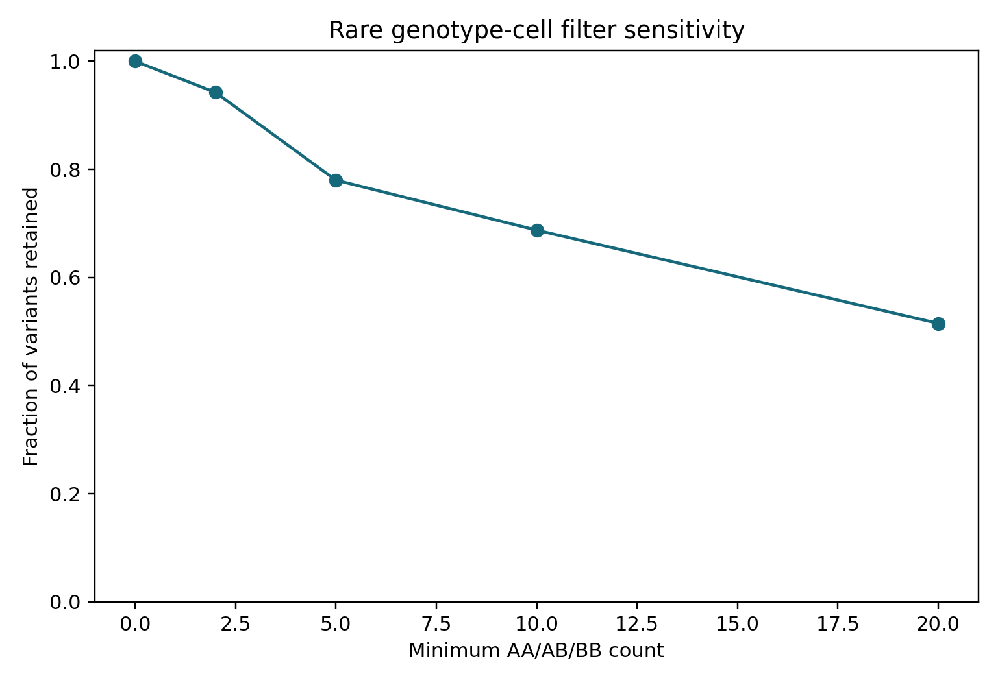

## External comparators

| comparator              | domgwas_test       |   n_joined |   spearman_rho | domgwas_top_snp   | comparator_top_snp   |   same_top_snp |
|:------------------------|:-------------------|-----------:|---------------:|:------------------|:---------------------|---------------:|
| PLINK additive OLS      | neglog_p_additive  |       2390 |          0.906 | rs100             | rs100                |              1 |
| PLINK genotypic DOMDEV  | neglog_p_dom_joint |       2390 |          0.905 | rs250             | rs250                |              1 |
| PLINK dominant          | neglog_p_additive  |       2391 |          0.652 | rs100             | rs100                |              1 |
| PLINK recessive         | neglog_p_additive  |       2391 |          0.364 | rs100             | rs100                |              1 |
| PLINK2 additive         | neglog_p_add_joint |       2390 |          0.911 | rs100             | rs100                |              1 |
| PLINK2 genotypic DOMDEV | neglog_p_dom_joint |       2390 |          0.905 | rs250             | rs250                |              1 |
| GCTA MLMA additive      | neglog_p_additive  |       2391 |          0.989 | rs100             | rs100                |              1 |

GCTA MLMA and domgwas selected the same top additive SNP with rho 0.989. PLINK's genotypic DOMDEV test and domgwas selected the same top dominance SNP with rho 0.905. Lower agreement with PLINK dominant/recessive coding is expected because those are one-parameter genotype contrasts rather than conditional heterozygote deviations.

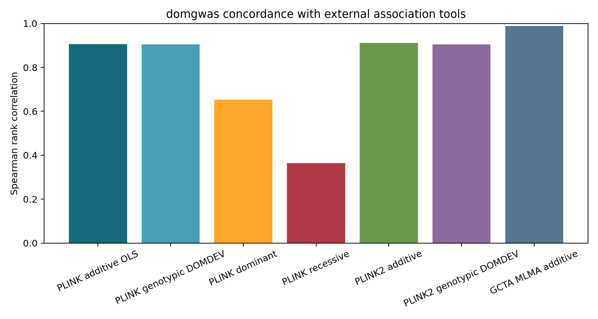

## Runtime and memory scaling

|   n_samples |   n_variants |   runtime_s |   wall_runtime_s |   peak_rss_mb |     n_rows |
|------------:|-------------:|------------:|-----------------:|--------------:|-----------:|
|          96 |    10000     |       0.299 |            2.268 |       165.703 |  10000     |
|          96 |    50000     |       1.403 |            3.366 |       219.293 |  50000     |
|          96 |   100000     |       2.689 |            4.75  |       255.148 | 100000     |
|          96 |        1e+06 |      27.103 |           29.085 |       709.273 |      1e+06 |

Corrected marker scaling remains approximately linear at n=96 through one million markers. The separate large-n kernel benchmark used 2,000 GRM markers, 1,000 tested markers, and a rank-256 genotype SVD:

|   n_samples |   approximation_rank |   randomized_svd_s |   association_transform_and_score_s |   relative_operator_probe_error |   peak_rss_mb |
|------------:|---------------------:|-------------------:|------------------------------------:|--------------------------------:|--------------:|
|        1000 |                  256 |              0.167 |                               0.109 |                           0.571 |       208.656 |
|        2500 |                  256 |              0.203 |                               0.264 |                           0.713 |       264.328 |
|        5000 |                  256 |              0.362 |                               0.515 |                           0.789 |       379.391 |

The rank-256 operator error increased from 0.57 at n=1,000 to 0.79 at n=5,000 for the deliberately flat simulated spectrum. This approximation is fast but not accurate enough as a default scientific result. Large-n use should increase rank adaptively and record an operator-error diagnostic; the exact dense path remains appropriate for the 811-animal real analysis.

## Previous synthetic ADDO comparison

Historical v0.1 synthetic comparisons are retained for continuity and labelled pre-fix. Both programs ranked the known monogenic additive and dominance loci first; rank correlations across 2,880 matched markers ranged from 0.795 to 0.940.

| dataset       | trait          | score              |   n_matched_variants |   spearman_addo_vs_domgwas |   addo_top_score |   domgwas_top_score |
|:--------------|:---------------|:-------------------|---------------------:|---------------------------:|-----------------:|--------------------:|
| rat_monogenic | mono_add_trait | additive           |                 2880 |                      0.894 |           36.933 |              45.608 |
| rat_monogenic | mono_add_trait | dominance_marginal |                 2880 |                      0.795 |           16.863 |              42.537 |
| rat_monogenic | mono_add_trait | avsad              |                 2880 |                      0.815 |            2.706 |               3.051 |
| rat_monogenic | mono_dom_trait | additive           |                 2880 |                      0.927 |           22.82  |              30.859 |
| rat_monogenic | mono_dom_trait | dominance_marginal |                 2880 |                      0.909 |           34.521 |              39.153 |
| rat_monogenic | mono_dom_trait | avsad              |                 2880 |                      0.94  |           16.34  |              16.136 |
| rat_polygenic | poly_trait     | additive           |                 2880 |                      0.897 |            6.479 |               9.259 |
| rat_polygenic | poly_trait     | dominance_marginal |                 2880 |                      0.794 |            3.875 |               6.634 |
| rat_polygenic | poly_trait     | avsad              |                 2880 |                      0.854 |            4.421 |               5.147 |

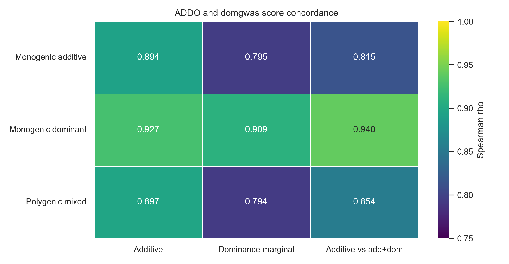

## Corrected four-phenotype ADDO comparison

| trait            | test                  |   n_complete_pairs |   spearman_rho |   addo_lambda_gc |   domgwas_lambda_gc |   addo_top_score |   domgwas_top_score |   same_top_position |
|:-----------------|:----------------------|-------------------:|---------------:|-----------------:|--------------------:|-----------------:|--------------------:|--------------------:|
| pr_max           | additive              |              30426 |          0.983 |            1.009 |               1.066 |            4.147 |               4.211 |                   1 |
| pr_max           | dominance_marginal    |              30426 |          0.983 |            1.109 |               1.146 |            3.843 |               4.233 |                   1 |
| pr_max           | dominance_conditional |              30426 |          0.982 |            1.08  |               1.144 |            3.373 |               3.384 |                   0 |
| addiction_index  | additive              |              30426 |          0.981 |            1.021 |               1.095 |            4.156 |               4.499 |                   1 |
| addiction_index  | dominance_marginal    |              30426 |          0.982 |            1.053 |               1.099 |            5.431 |               5.916 |                   1 |
| addiction_index  | dominance_conditional |              30426 |          0.98  |            1.039 |               1.098 |            3.473 |               3.619 |                   1 |
| lga_total_intake | additive              |              30426 |          0.989 |            0.956 |               1.06  |            4.56  |               4.693 |                   1 |
| lga_total_intake | dominance_marginal    |              30426 |          0.992 |            1.028 |               1.055 |            4.464 |               4.607 |                   1 |
| lga_total_intake | dominance_conditional |              30426 |          0.998 |            1.063 |               1.065 |            3.511 |               3.498 |                   1 |
| sha_total_intake | additive              |              30426 |          0.995 |            1.083 |               1.141 |            4.321 |               4.489 |                   0 |
| sha_total_intake | dominance_marginal    |              30426 |          0.997 |            0.975 |               0.996 |            4.44  |               4.412 |                   1 |
| sha_total_intake | dominance_conditional |              30426 |          0.999 |            1.027 |               1.024 |            4.063 |               4.051 |                   1 |

The exact-GLS domgwas run took 19.47 s; ADDO took 2789.1 s. The same top position was selected in 10/12 comparisons. Real-data lambda reached 1.146, so association claims should retain sex/cohort/PC adjustment and inspect residual stratification.

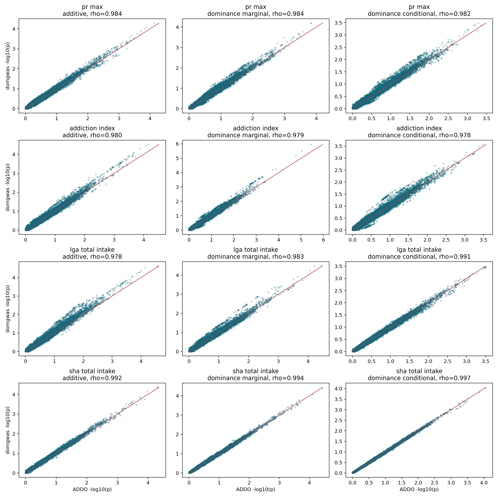

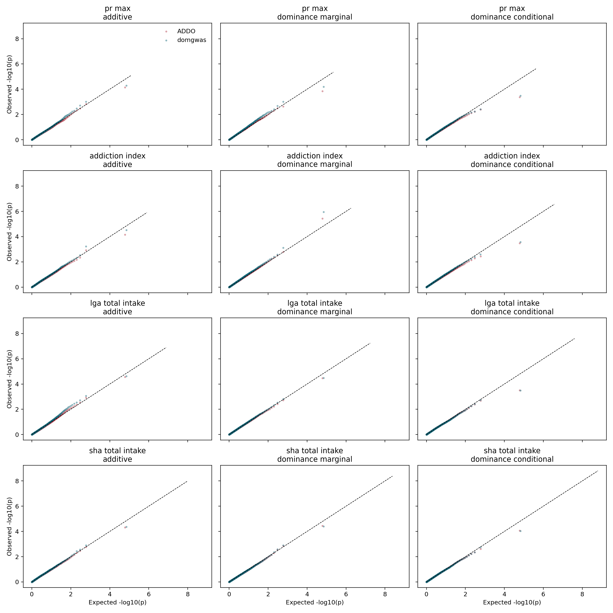

## Full real-data scan

The corrected quantitative-trait model scanned 7,659,686 variants across 20 autosomes in 811 animals, with sex, cohort, and PC1-PC5 (fixed-effect rank 28) in the complete transformed design. The additive LOCO GRM used the 35,723-marker QC panel. 4,686,464 variants passed the five-per-genotype-cell requirement. Runtime was 17.4 minutes and peak RSS was 5282 MB. The source contained 7,879,575 records; 219,889 markers labelled 21, 22, or 24 were excluded because sex-chromosome and mitochondrial association requires sex-aware models outside the validated autosomal scope.

|   chrom |   n_variants |   n_pass_cell_filter |    h2 |   lambda_additive |   lambda_dominance | top_additive_snp   |   top_additive_score | top_dominance_snp   |   top_dominance_score |
|--------:|-------------:|---------------------:|------:|------------------:|-------------------:|:-------------------|---------------------:|:--------------------|----------------------:|
|       1 |       779627 |               502311 | 0.007 |             0.861 |              0.886 | 1:172502172        |                2.864 | 1:5621784           |                 2.984 |
|       2 |       860455 |               482087 | 0     |             0.868 |              1.394 | 2:33075446         |                4.074 | 2:80635859          |                 2.896 |
|       3 |       450864 |               266680 | 0     |             1.073 |              1.205 | 3:36614268         |                3.261 | 3:157112793         |                 3.027 |
|       4 |       555177 |               364047 | 0     |             0.707 |              1.188 | 4:136010728        |                2.891 | 4:90866343          |                 2.487 |
|       5 |       568594 |               322138 | 0.003 |             0.829 |              0.989 | 5:63681065         |                3.353 | 5:80321426          |                 3.796 |
|       6 |       413737 |               270015 | 0     |             0.967 |              0.948 | 6:106695654        |                3.637 | 6:12198054          |                 3.854 |
|       7 |       425055 |               236833 | 0     |             1.166 |              0.896 | 7:113444507        |                3.623 | 7:112935704         |                 3.142 |
|       8 |       367614 |               222014 | 0     |             1.613 |              1.039 | 8:39382416         |                4.411 | 8:120286455         |                 2.799 |
|       9 |       355212 |               224660 | 0     |             0.913 |              1.177 | 9:36111486         |                3.07  | 9:102348118         |                 2.895 |
|      10 |       299449 |               207427 | 0.005 |             0.777 |              1.198 | 10:67553251        |                2.686 | 10:99595212         |                 4.174 |
|      11 |       260910 |               144929 | 0     |             1.035 |              1.167 | 11:15820321        |                2.654 | 11:94412910         |                 3.121 |
|      12 |       144024 |                89594 | 0     |             1.054 |              1.374 | 12:24153924        |                2.805 | 12:16861939         |                 3.488 |
|      13 |       399598 |               286143 | 0.003 |             0.845 |              0.579 | 13:63098706        |                3.18  | 13:57514033         |                 2.404 |
|      14 |       341362 |               230166 | 0     |             1.188 |              1.465 | 14:12744664        |                3.639 | 14:106447705        |                 3.416 |
|      15 |       296659 |               168731 | 0     |             1.078 |              1.147 | 15:64419558        |                2.773 | 15:65963294         |                 2.809 |
|      16 |       291366 |               172057 | 0.01  |             0.773 |              1.111 | 16:26999412        |                2.43  | 16:85495753         |                 3.421 |
|      17 |       239933 |               125923 | 0     |             1.122 |              1.213 | 17:77446689        |                3.42  | 17:80269531         |                 3.251 |
|      18 |       240810 |               128396 | 0     |             0.888 |              1.129 | 18:17228430        |                3.435 | 18:10508369         |                 3.31  |
|      19 |       150474 |                97926 | 0     |             0.768 |              0.627 | 19:61763225        |                2.61  | 19:72136166         |                 2.722 |
|      20 |       218766 |               144387 | 0.006 |             0.776 |              0.851 | 20:158158          |                2.795 | 20:3573954          |                 2.781 |

Across all autosomes, lambda was 0.929 for the conditional additive test and 1.057 for conditional dominance. Maximum scores were 4.411 and 4.174; neither test produced a Bonferroni-significant marker.

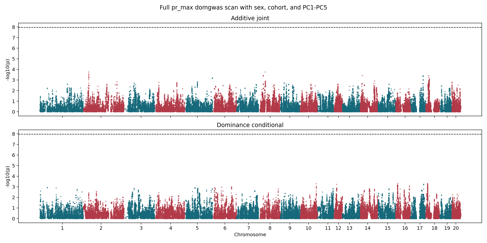
## Installation and reproducibility

domgwas installs from the local Python package with five direct scientific dependencies. ADDO required a 1.82 GB Conda/R environment, PLINK and GCTA executables, a patch for archived R dependencies and removed C APIs, Windows command wrappers, and one-worker execution. This is an operational comparison, not evidence against ADDO's statistical model.

The public repository includes source tests, a synthetic end-to-end example, the aggregate validation report and figures, and a command-line interface. The larger internal validation archive retains fixed-seed scripts, raw replicate CSVs, command logs, and controlled real-data paths. Binary traits are explicitly outside scope because no logistic mixed model is implemented.

## Remaining work before submission

1. Replicate top real loci in an independent cohort or functional dataset; no local analysis can manufacture independent biological replication.
2. Approve and register `PREREGISTRATION_AND_REPLICATION_PROTOCOL.md`, which drafts the phenotype definition, exclusions, covariates, QC thresholds, primary tests, and replication criteria.
3. Improve adaptive low-rank selection at n > 4,000 and require an operator-error diagnostic; rank 256 was inadequate for the flat-spectrum stress test.
4. Add continuous integration and clean installation tests on Windows, Linux, and macOS, then archive an immutable release and benchmark bundle.
5. Keep the package quantitative-trait-only unless a separately validated logistic mixed-model implementation is added.
6. Treat shared-family/cohort inflation and real-trait lambda above one as model diagnostics; add measured fixed effects or stratified/meta-analysis designs where appropriate.

## Paper-ready claim

"domgwas is a pure-Python, streaming, dominance-aware quantitative-trait GWAS implementation that performs complete-design GLS under an additive LOCO covariance model, supports joint additive/dominance association and sign-aware inheritance classification, and shows high rank concordance with ADDO with substantially simpler installation and faster execution on the tested workstation."

Do not claim that additive-only LOCO is universally superior to additive-plus-dominance covariance, that runtime ratios generalize across platforms, or that concordance establishes biological accuracy.

## Reproducibility command

```bash
python -m pip install -e ".[test,plot]"
python -m pytest -q
python examples/quickstart.py
```

## Reference

Cui L, Yang B, Pontikos N, Mott R, Huang L. ADDO: a comprehensive toolkit to detect, classify and visualize additive and non-additive quantitative trait loci. *Bioinformatics*. 2020;36(5):1517-1521. doi:10.1093/bioinformatics/btz786.

## Publication assessment

**Current status: methods/software preprint ready; final submission still needs independent replication and large-n approximation hardening.** The earlier exact-GLS and covariate blockers are resolved and verified. The strongest remaining limitations are external biological validation, residual structure in some real traits, and low-rank behavior beyond the exact dense sample-size range.
